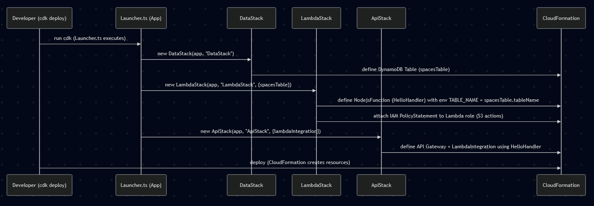
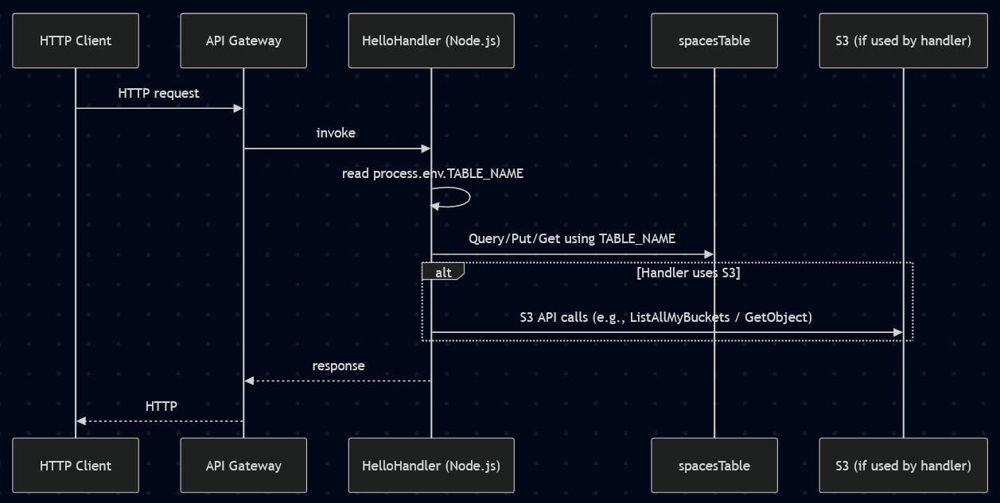

### AWS LAMBDA CODE CHALLENGES
# Dependency Management
# TypeScript Compilation and bundling

## Dependency Management
Runable application can be broken down into app code and Dependencies(Node_Module) and dependency can be further broken down into AWS SDK and thirdPartyLib, we will have to make sure that we don't deploy dev dependencies like tsnode etc and also aws sdk since by default aws sdk already there in aws.

## TypeScript Compilation and bundling
We have to make sure that we do proper tree shaking and convert ts code to js code

## Solution
NodeJsFunction CDK construct (uses esbuild library under the hood)(aws-lambda-nodejs)

## Sequence diagram - Infrastructure synthesis / deploy

## Sequence diagram - Runtime request flow
